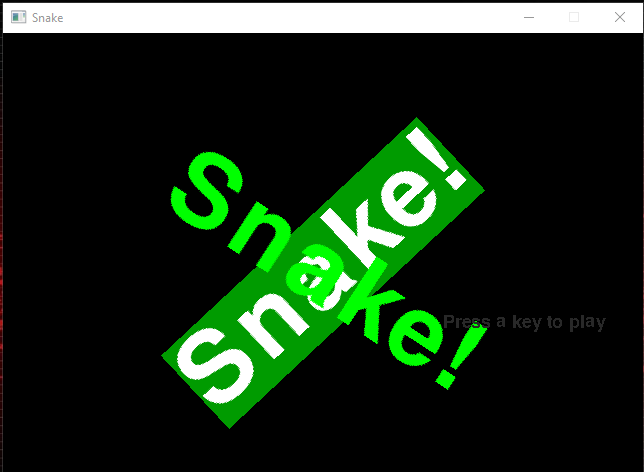
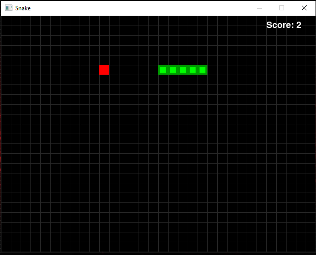

# snake
A port of the program from [Chapter 6](http://inventwithpython.com/pygame/chapter6.html) of `Making Games with Python & Pygame` to Rust.'

Intro screen

Gameplay

To run under Windows (powershell):
* Place SDL `*.lib` and `*.dll` into a folder.
* `$env:RUSTFLAGS="-L <path to SDL libs>"`
* `$env:Path += ";<path to SDL libs>"`
* `cargo run --release`

To run under Windows (cmd):
* Place SDL `*.lib` and `*.dll` into a folder.
* `set RUSTFLAGS=-L <path to SDL libs>`
* `set PATH=%PATH%;<path to SDL libs>`
* `cargo run --release`